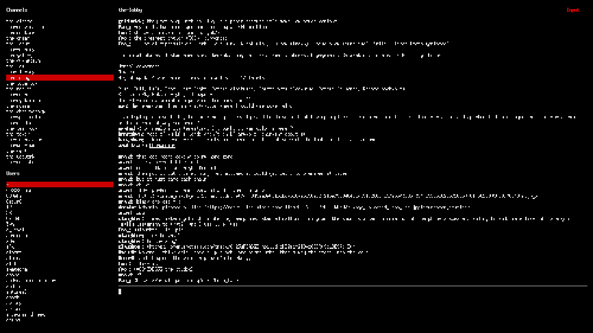

[](https://joshavanier.itch.io/log/)


**Stack** is a fork of [@evanyeung](https://github.com/evanyeung)'s [terminal client](https://github.com/evanyeung/terminal-slack) for Slack, featuring minor design tweaks and the ability to use the mouse for scrolling.

### Commands

| Command | Key Combination |
| ------- | --------------- |
| Move up | <kbd>⬆</kbd> or <kbd>k</kbd> |
| Down up | <kbd>⬇</kbd> or <kbd>j</kbd> |
| Search | <kbd>/</kbd> |
| Exit | <kbd>Ctrl</kbd> + <kbd>q</kbd> |
| Select Channels | <kbd>Ctrl</kbd> + <kbd>c</kbd> |
| Select Users | <kbd>Ctrl</kbd> + <kbd>u</kbd> |
| Select writing area | <kbd>Ctrl</kbd> + <kbd>w</kbd> |
| Select Messages | <kbd>Ctrl</kbd> + <kbd>l</kbd> |

### Setup

First, install Stack:

```
git clone https://github.com/joshavanier/stack.git
cd stack
npm install
```

Then set up Slack. You'll need a [Slack Legacy Token](https://api.slack.com/custom-integrations/legacy-tokens):

```
export SLACK_TOKEN='your-slack-token-here'
```

Finally, just run the program:

```
node main.js
```

---

Josh Avanier

[](https://twitter.com/joshavanier) [](https://joshavanier.github.io)
